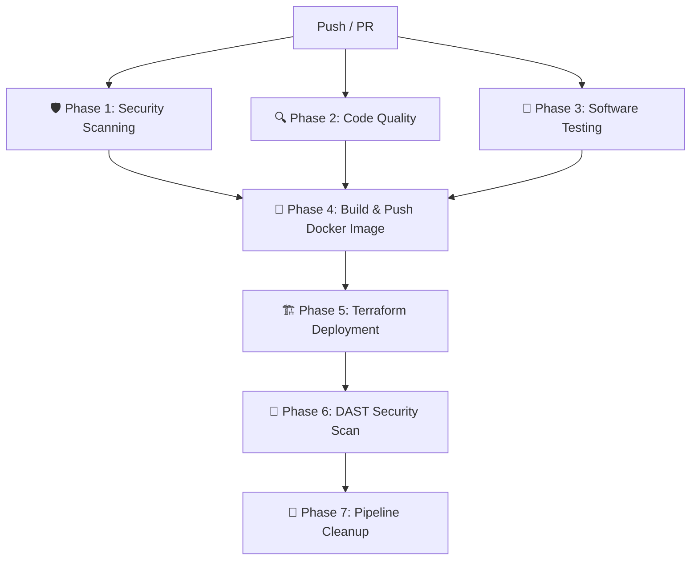

# 🔒 DevSecOps CI/CD Pipeline for Motor-X


-green?style=flat-square&logo=vitest)

An enterprise-grade, 7-phase **DevSecOps Teaching Pipeline** demonstrating automated security scanning (SAST/DAST), software testing, Docker multi-stage containerization, and Infrastructure-as-Code (IaC) deployment with Terraform.

---

## 🏗️ 7-Phase DevSecOps Pipeline Architecture

The GitHub Actions workflow (`.github/workflows/ci.yml`) runs on every push to `main` and pull request:



| Phase | Category | Tool | Description |
| :--- | :--- | :--- | :--- |
| **Phase 1** | Security Scanning | **Gitleaks**<br>**OSV-Scanner**<br>**Semgrep SAST** | • Secret detection (hardcoded keys)<br>• Open-source vulnerability scanning<br>• Static Application Security Testing for React/TS |
| **Phase 2** | Code Quality | **TypeScript (`tsc`)** | Strict type-checking (`tsc --noEmit`) |
| **Phase 3** | Software Testing | **Vitest** | 25 unit tests covering car data integrity, filter logic, and UI rendering |
| **Phase 4** | Build & Push | **Docker & Docker Hub** | Multi-stage Node 22 Alpine build $\rightarrow$ Nginx Alpine production image pushed to Docker Hub |
| **Phase 5** | IaC Deployment | **Terraform** | Deploys container using `kreuzwerker/docker` provider on port `3000` |
| **Phase 6** | DAST Scan | **OWASP ZAP** | Dynamic Application Security Testing baseline scan against `http://127.0.0.1:3000` |
| **Phase 7** | Cleanup | **Terraform Destroy** | Tears down test container after DAST scanning |

---

## 🚀 Deployment Architecture Options

When running in GitHub Actions, Terraform deploys the container to the runner's ephemeral environment (`http://127.0.0.1:3000`) so OWASP ZAP can run DAST scans against a live app. 

For **production or student laboratory setups**, use one of the following deployment models:

### Comparison Table

| Solution | Host Location | Access URL | Best For |
| :--- | :--- | :--- | :--- |
| **Ephemeral CI (Default)** | GitHub Runner | `http://127.0.0.1:3000` (CI only) | Automated DAST scanning |
| **Remote Cloud SSH (Option 1)** | AWS EC2 / DigitalOcean | `http://<SERVER_IP>:3000` | Production deployment |
| **Self-Hosted Runner (Option 2)** | Vagrant / VirtualBox VM | `http://<VM_IP>:3000` | Local classroom labs |
| **Free PaaS (Option 3)** | Render / Koyeb | `https://motor-x.onrender.com` | Live student portfolio |

---

### Option 1: Deploy to Remote Cloud Server (Industry Standard)
The GitHub runner stays on `ubuntu-latest`, but Terraform connects remotely via SSH:
```hcl
# terraform/main.tf
provider "docker" {
  host = "ssh://ubuntu@<YOUR_SERVER_IP>"
}
```

### Option 2: Deploy to Local Vagrant / VirtualBox VM (Self-Hosted Runner)
1. Register your local VM as a runner in GitHub: **Settings > Actions > Runners**.
2. Update `.github/workflows/ci.yml`:
   ```yaml
   runs-on: self-hosted
   ```
3. Deploy locally:
   ```bash
   cd terraform
   terraform apply -var="vm_ip=192.168.56.10"
   ```
   Access at: `http://192.168.56.10:3000`

---

## 🛠️ Local Development & Testing

### 1. Run Software Unit Tests
```bash
npm test
npm run test:coverage
```

### 2. Run Type Checks
```bash
npm run lint
```

### 3. Build Docker Image Locally
```bash
docker build -t motor-x:latest .
docker run -d -p 3000:80 --name motor-x motor-x:latest
# Open http://localhost:3000
```

### 4. Deploy Infrastructure with Terraform
```bash
cd terraform
terraform init
terraform plan
terraform apply
```

---

## 🔑 GitHub Repository Secrets Configuration

To enable Phase 4 (Build & Push), configure the following repository secrets in **Settings > Secrets and variables > Actions**:

| Secret Name | Description | Required |
| :--- | :--- | :--- |
| `DOCKERHUB_USERNAME` | Your Docker Hub account username (e.g. `deenamanick`) | Yes |
| `DOCKERHUB_TOKEN` | Docker Hub Access Token (Read/Write) | Yes |
| `SEMGREP_APP_TOKEN` | Semgrep Cloud Platform API Token | Optional |

---

## 📁 Repository Structure

```
├── .github/
│   ├── CODEOWNERS             # Code ownership rules
│   ├── dependabot.yml         # Dependabot manual update config
│   └── workflows/
│       └── ci.yml             # 7-phase DevSecOps pipeline
├── src/
│   ├── __tests__/             # Vitest test suites (25 tests)
│   ├── components/            # React UI components
│   └── data/                  # Car inventory data
├── terraform/
│   ├── main.tf                # Docker provider infrastructure definition
│   ├── variables.tf           # Terraform variables (vm_ip, ports, images)
│   └── outputs.tf             # Outputs (URL, container ID)
├── Dockerfile                 # Multi-stage build (Node 22 Alpine -> Nginx Alpine)
├── nginx.conf                 # SPA routing & Nginx security headers
├── vitest.config.ts           # Vitest testing configuration
└── package.json               # Dependencies & scripts
```

---

## 📜 License
MIT License — Created for DevSecOps training and educational demonstrations.
